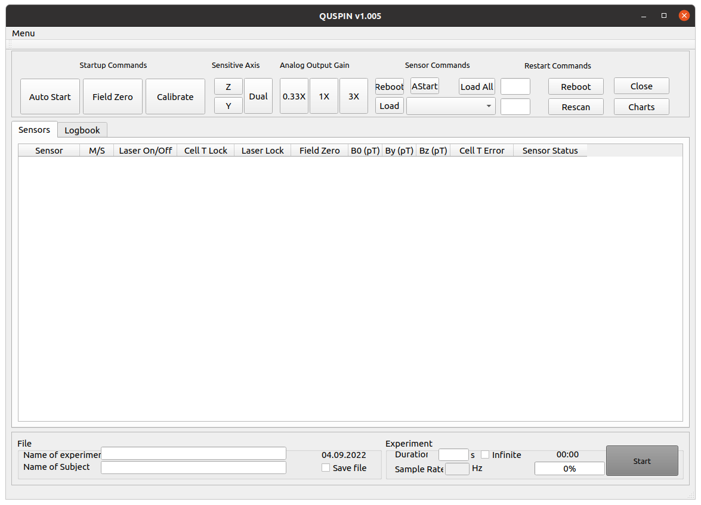
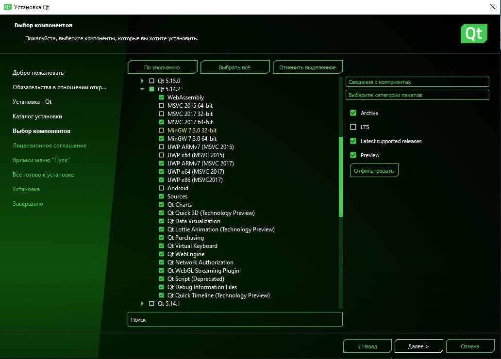
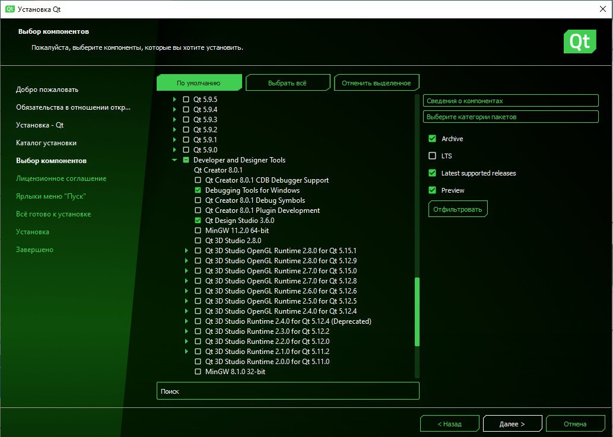
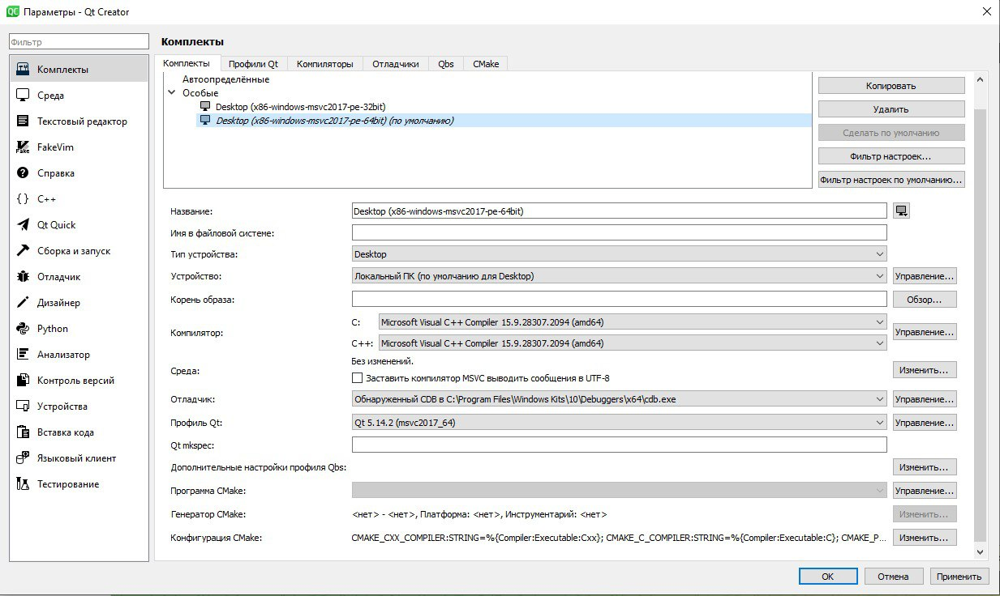

# Quspin



## How to run Quspin.exe on every Windows:

1) Put all .dll files from amd64 folder in this repository to your C:\Windows\System32 folder.

2) Go here: https://drive.google.com/file/d/1btAtmC5bpDIZeOk5qBX7EvpbCyRZcYcm/view?usp=sharing and install National Instruments DAQmx driver installer. Run it.

3) Run the last .exe version of this programm from quspin_exe folder in this repository and be happy.

## How to build on Linux:
```shell
cd ~/Desktop
git clone git@github.com:kroharu/Quspin.git
sudo apt update
sudo apt-install qt5-default
sudo apt-get install build-essential
sudo apt-get install libgt5serialport5
sudo apt-get install libgt5serialport5-dev
sudo apt-get install libqt5charts5
sudo apt-get install libqt5charts5-dev
sudo apt dist-upgrade
```
-- Turn ON your VPN here --
```shell
sudo apt install ./Quspin/NILinux2020DeviceDrivers/ni-software-2020-bionic_20.1.0.49152-0+f0_all.deb
sudo apt update
reboot
```
-- After rebooting your PC --
```shell
cd ~/Desktop/Quspin/Quspin
qmake
make && ./Quspin
```
## How to build on Windows:

### Turn on your VPN here

1) Go here: https://www.qt.io/download-qt-installer?hsCtaTracking=99d9dd4f-5681-48d2-b096-470725510d34%7C074ddad0-fdef-4e53-8aa8-5e8a876d6ab4 and download Qt installer.
After that run installed exe file, input your mail and password to sign in and push next button until you reach the installation page. Here put a check mark in a box "archive" and select all necessary components like on a screenshot.



2) Go here: https://download.qt.io/archive/qtcreator/4.11/4.11.2/ and choose qt-creator-opensource-windows-x86_64-4.11.2.exe. After that run installed Qt Creator installer.

### You can turn off your VPN here

3) Go to the Qt folder, which default location should be like C:\Qt. There should be Qt creator folder - place it into the Tools folder. Also put Quspin folder from this github repository to C:\Qt\QtProjects folder (you should make QtProjects folder by yourself).

4) Put all .dll files from amd64 folder from this repository to your C:\Windows\System32 folder.

5) Go here: https://visualstudio.microsoft.com/ru/thank-you-downloading-visual-studio/?sku=BuildTools&rel=15 to install VS Build Tools install manager.
Run it and choose only Windows Desktop SDK.

6) Go here: https://drive.google.com/file/d/1btAtmC5bpDIZeOk5qBX7EvpbCyRZcYcm/view?usp=sharing and install National Instruments DAQmx driver installer. Run it.

7) Go to C:\Qt\Tools\Qt Creator\bin and run qtcreator.exe file. Open Quspin.pro project, which should be in C:\Qt\QtProfects\Quspin. You will be redirected to the project settings page. Click on "setup project". Click on Qt Profile, choose add.. and browse C:\Qt\5.14.2\msvc2017_64\bin - there you'll find qmake.exe. Then make your configuration screen like this:


### Enjoy!

https://download.qt.io/archive/qt/5.14/5.14.2/
https://download.qt.io/archive/qtcreator/4.11/4.11.2/